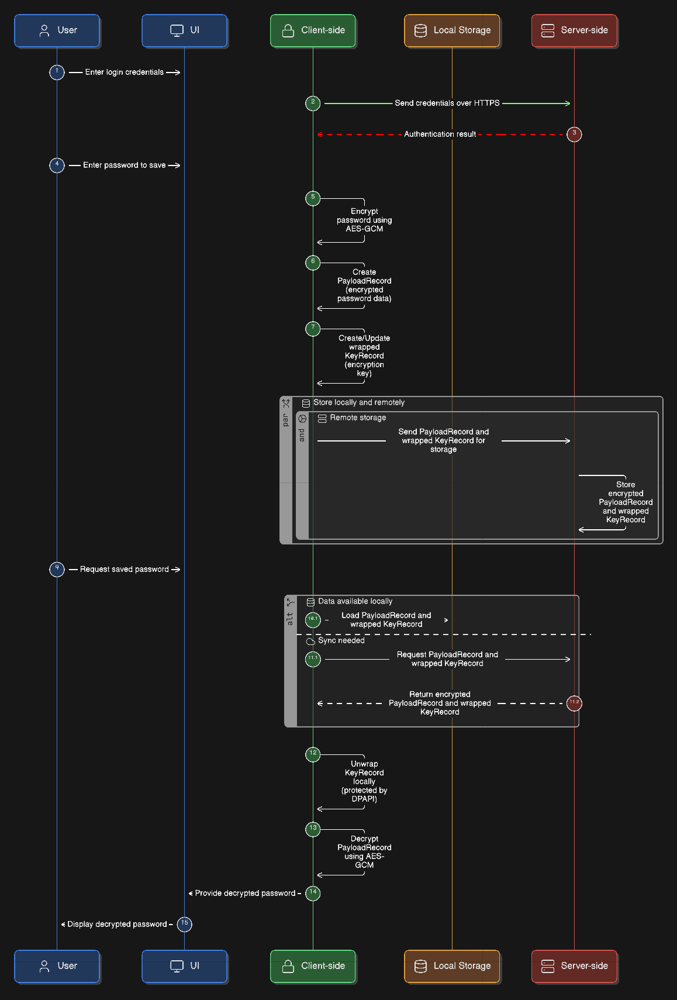

# Weardian

## Current Status

🚧 Work in progress 🚧

Weardian is a zero-knowledge password encryption application that ensures sensitive data is never exposed, including on server.

It encrypts passwords client-side into secure keys and stores only encrypted (wrapped) data remotely. The server has no ability to decrypt or access user secrets.

---

## How It Works

- Passwords are encrypted on the client using AES-GCM
- Encryption keys are securely wrapped before storage or transmission
- Only wrapped (encrypted) keys are sent to the server
- The server acts as a "dumb" storage layer with zero knowledge of plaintext data
- Local storage is additionally protected using DPAPI

---

## Tech Stack

- **Backend:** ASP.NET (REST API, JWT auth, Identity)
- **Frontend (in progress):** React (via WebView2 desktop)
- **Encryption:** AES-GCM, key wrapping
- **Storage:** SQL database (encrypted data only)

---

## Features

### Client-Side
- AES-GCM authenticated encryption for passwords
- Secure key wrapping for storage and sync
- DPAPI protection for local key storage
- Optional encrypted sync with remote server
- Atomic file writes to prevent corruption

### Server-Side
- ASP.NET RESTful API
- JWT-based authentication
- SQL persistence for encrypted data only
- Zero-knowledge architecture (no plaintext access)

---

## Planned Features

- Remote synchronization of encrypted PayloadRecords
- Logging (client + server diagnostics)
- Support for multiple key types
- Support for encrypting different data types
- Asymmetric encryption support
- Additional symmetric encryption options
